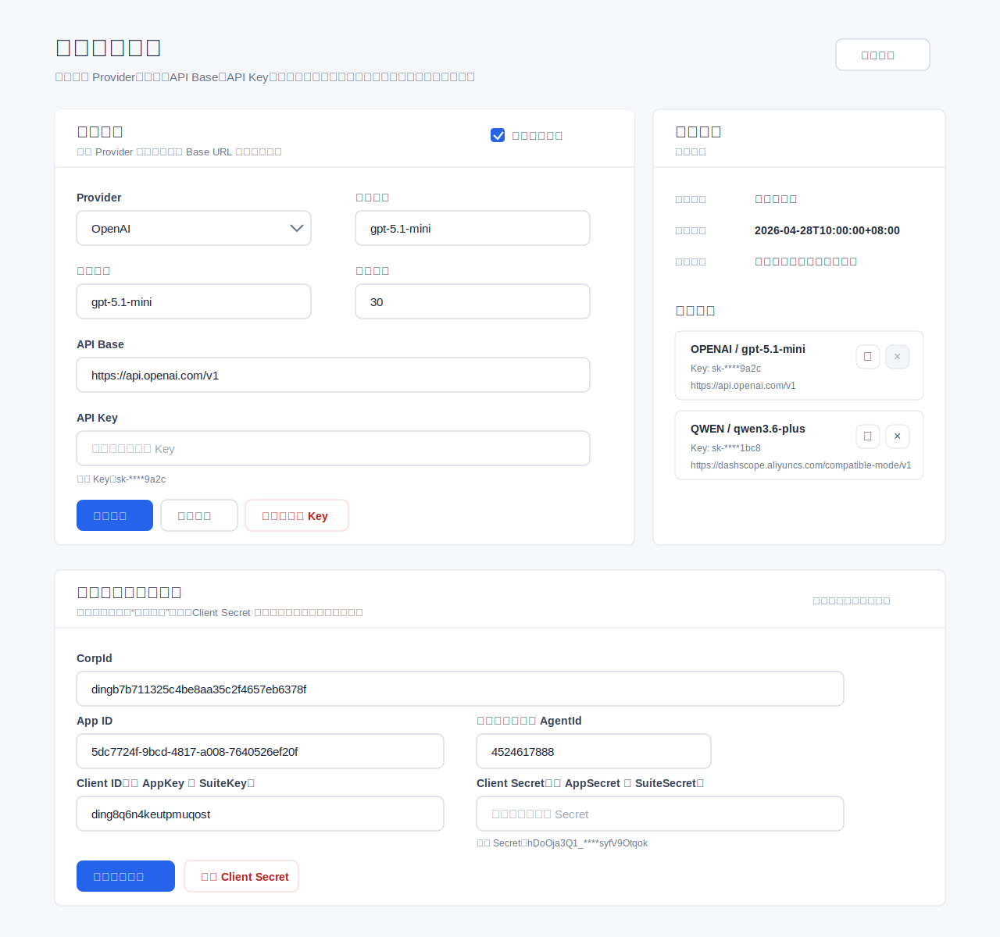

# 通用模型配置页面

这套文件用于把当前多个系统里的“模型配置页面”抽成可复用资产。页面不绑定某一个项目的数据库、配置文件或重启方式，其他系统只需要实现一层 API 适配器，就可以复用同一套前端。



## 功能总结

- Provider 选择：支持 OpenAI、Qwen、自定义 OpenAI-compatible 接口。
- 模型配置：支持文本模型，按能力开关可支持视觉模型。
- API Base 配置：自动填入 Provider 默认地址，也允许自定义。
- API Key 管理：默认只显示脱敏 Key，支持替换、保留、清空，不要求回显原始 Key。
- 连通性测试：通过后端适配器调用真实模型接口，前端只展示结果。
- 历史配置：按配置内容自动去重，支持历史回填和删除，当前配置可标记为不可删除。
- 多环境：默认隐藏；代码评审等特殊系统可通过 `capabilities.environmentTabs=true` 打开。
- 钉钉第三方应用配置：支持 CorpId、App ID、原企业内部应用 AgentId、Client ID、Client Secret。
- 无依赖预览：直接打开 `index.html` 可用 mock 数据预览页面。

## 页面结构

- 顶部：页面标题、说明、刷新按钮。
- 环境切换：默认不显示；仅在后端返回 `capabilities.environmentTabs=true` 且 `environments` 多于一个时显示。
- 模型配置表单：Provider、模型、视觉模型、API Base、API Key、启用状态、超时时间。
- 操作区：保存、测试连接、清空已保存 Key。
- 测试结果：显示成功/失败、使用模型、响应 ID、输出预览。
- 历史配置：展示最近去重后的配置，支持回填和删除。
- 状态说明：展示来源、更新时间、运行状态。
- 钉钉第三方应用配置：位于模型配置下方，作为全局集成配置，不跟模型环境强绑定。

## 目录结构

```text
tools/model-config-page/
  index.html              # 独立预览页面，直接浏览器打开
  model-config.css        # 页面样式，全部使用 mcfg 前缀
  model-config.js         # 无框架前端逻辑，可嵌入其他系统
  api-contract.md         # 后端适配器接口契约
  preview.svg             # 页面预览图
  README.md               # 功能、页面和使用说明
```

## 快速预览

直接打开：

```text
/home/AI/CPL/tools/model-config-page/index.html
```

默认启用 mock 模式，不会访问真实后端，也不会保存真实配置。

## 快速接入

在任意系统页面中引入样式和脚本：

```html
<link rel="stylesheet" href="/tools/model-config-page/model-config.css">
<div id="model-config-root"></div>
<script src="/tools/model-config-page/model-config.js"></script>
<script>
  ModelConfigPage.mount('#model-config-root', {
    mock: false,
    apiBase: '/api/model-config',
    title: '模型配置页面',
    subtitle: '配置模型调用和钉钉第三方应用配置所需的运行时参数。'
  });
</script>
```

后端实现 `api-contract.md` 中的接口即可。现有系统可以先做一层薄适配器，把自己的原接口转换成通用数据结构：

- `ai_code_review`：如需 `new/old` 两个环境切换，可返回 `capabilities.environmentTabs=true`。
- `SOP`：适配当前 `/api/ai/config` 数据，保留 `enabled`、`timeoutSeconds` 能力。
- `ai_patents`：适配 `/api/system/model-config`，开启 `visionModel` 能力，保存后作用于新的模型请求。
- 钉钉配置：适配 `DINGTALK_APP_ID`、`DINGTALK_AGENT_ID`、`DINGTALK_CLIENT_ID`、`DINGTALK_CLIENT_SECRET`，也可兼容旧命名 `DINGTALK_APP_KEY` / `DINGTALK_APP_SECRET`。

## 推荐复用边界

建议复用这套页面和接口契约，但不要把各项目的存储逻辑混到页面里：

- 通用页面只负责展示、收集表单、调用接口。
- 通用接口只表达 Provider、模型、Key、历史、测试结果。
- 每个业务系统自己负责读取数据库、JSON 配置、环境变量、容器重启和权限校验。

## 安全建议

- 默认不要提供“读取原始 API Key”接口。
- 页面只接收 `hasApiKey` / `apiKeyMasked`、`hasClientSecret` / `clientSecretMasked`。
- 替换 Key 或 Secret 时提交新值；保留时不提交；清空时提交 `clearApiKey: true` 或 `clearClientSecret: true`。
- 后端日志、错误消息、测试失败详情都要脱敏。
- 模型连通性测试应在后端执行，前端不要直接持有服务端长期 Key。
- 钉钉 Client Secret 与模型 Key 一样处理，不应从后端回显原文。
